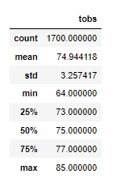
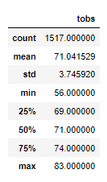
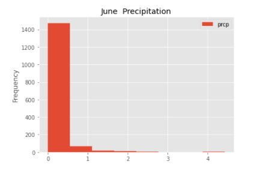
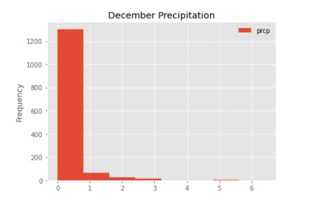

# Surf’s Up Analysis

## Project Overview

Using data storage and retrieval to analyze weather data in the area of a new surf and ice cream shop. Weather data to help determine if said business could be consistently successful.

## Resources

### Data Sources 

hawaii.sqlite

### Software 

* Python
* Anaconda
* Jupyter Notebook
* VSCode

## Results

The descriptive statistics for temperature in the months of June and December, as well as the frequency of rainfall in inches, can be seen below:

While at a glance the weather seems comparable between June and December, some differences should be noted, as the business would rely heavily on warm, dry weather.

The minimum temperature in December is 56 degrees, while the minimum temperature in June is 64 degrees.

Neither month saw excessive rainfall, however, December does have more frequent counts of higher amounts of rain.

The average temperature in June is almost 4 degrees higher than in December.

## Surf’s Up Summary

While December does show slightly lower temperatures and slightly increased rainfall, overall the weather is comparable. The data in both June and December support the opening of a surf and ice cream shop to be operational year-round. 
